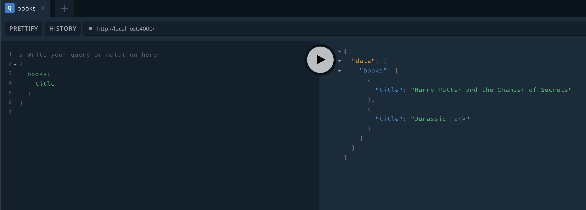
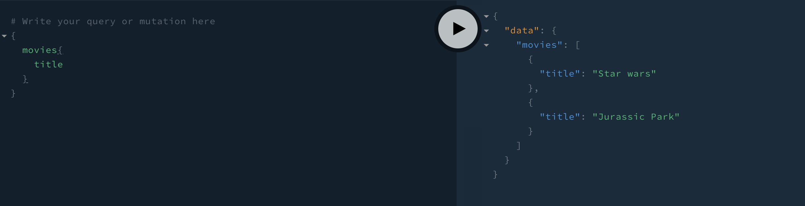

# Apollo Server

A example example of Apollo server run on kubernetes with helm.

_Developed locally with skaffold_


## Apollo server resolvers

The server example has a `resolvers.js` which builds with the docker image and works to show us a basic example.

We can inject a new resolvers file through a configmap via k8s to power up the server with additional resolvers as shown `templates/configmap-resolvers.yaml`

```
kubectl exec test-apollo-8488d5b6f6-h9xll cat resolvers.js
const movies = [
  {
    title: 'Star wars',
    releaseDate: '1977'
  },
  {
    title: 'Jurassic Park',
    releaseDate: '1993'
  },
];

const resolvers = {
  Query: {
    movies: () => movies,
  },
};

module.exports = resolvers;
```

_Here we have deployed in our configmap of resolvers, this is a nice solution when combined with versioned helm releases_

*Run locally before injection:*



*After:*




## Skaffold

For local reloading whilst working within `server/*.js` just run `skaffold dev` from the root directory (assuming k8s and minikube installed)

## node_modules

This kind of repo structure for educational purposes causes some performance issues with helm.
Large node_modules folders will stop helm gzip and configmap deploying so they need to be added to `.helmignore`


## Helm Deployment

`helm install . --name=apollo-server-release -n apollo`

## Helm Undeployment

`helm remove apoll-server-release --purge`
